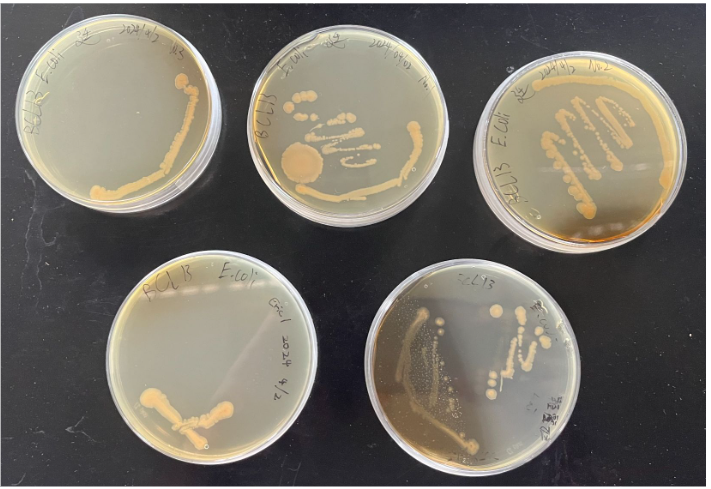

# 4/2 單一菌落分離
### 目的： 從一堆大腸桿菌中分離出單一細菌菌落
### 器材： <i>E.coli</i> 、裝有LBplate的培養皿、接種環、酒精燈、封口臘膜(parafilm)
### 步驟：
1. 消毒器材及桌面
1. 點燃酒精燈
1. 將接種環前端用酒精燈加熱燒紅殺菌
1. 稍微打開有大腸桿菌的培養皿，將燒紅的接種環接觸培養基無菌的地方降溫
1. 沾取一個菌落後用接種環在新培養皿畫一條線  
1. 使用酒精燈燒紅接種環滅菌，使用一樣的方法降溫後利用上次畫的線延伸出另一條線，重複兩次。
1. 重複完後用接種環塗在剩下的空白處，塗的線不能重疊
1. 消毒接種環
1. 用封口蠟膜封住培養皿
### 結果：一些培養皿被感染，長出其他菌種。沒被感染的培養皿有些在最後一步長不出細菌

  

# 4/16 嘗試配置培養基
### 目的：學習如何製作培養皿減少製作LB plate時的浪費
### 器材：以滅菌培養皿、錐形瓶、滅菌釜、蒸餾水、NaCl、葡萄糖、Agar、電子秤、量筒
### 步驟：
1. 用量筒測出100ml蒸餾水，倒入錐形瓶
1. 利用電子秤測量2g Agar, 2g 葡萄糖, 1g NaCl倒入錐形瓶
1. 倒800ml水進滅菌釜
1. 將錐形瓶放入滅菌釜殺菌60min
1. 取出錐形瓶馬上將培養基倒入培養皿中
1. 等待培養基凝固
### 結果：第一次倒的速度太慢培養基在倒入培養皿前就先凝固，第二次馬上倒培養基培養基是平的，有成功
  

# 4/23 萃取葡萄花青素
### 目的：從葡萄中取得水溶性物質花青素
### 器材：葡萄、加熱版、燒杯、蒸餾水、紗布
### 步驟：
1. 把一些葡萄的皮剝下，一些不要剝，分成葡萄皮、葡萄果肉、整顆葡萄三種
1. 在三個燒杯加入100ml的蒸餾水
1. 三個燒杯分別放入皮、果肉、整顆葡萄
1. 利用加熱版加熱到攝氏90度
1. 等待加熱10分鐘
1. 把液體通過紗布過濾裡面的葡萄皮與果肉，將液體倒入另一個燒杯
### 結果：得到葡萄汁
  

# 5/21 萃取番茄茄紅素
### 目的：從番茄中萃取酯溶性物質茄紅速
### 器材：番茄、乙酸乙酯、錐形瓶、刀、研缽、烘箱、水浴槽、培養皿、軟木塞、紗布、加熱版
### 步驟：
1. 將番茄切成薄片讓番茄比較好被烘乾
1. 把番茄片放進培養皿
1. 放進烘箱烘4小時取出番茄乾
1. 番茄乾倒進研缽，磨成番茄粉
1. 番茄粉倒入錐形瓶，加入乙酸乙酯後用軟木塞塞住
1. 泡進水浴槽，固定溫度攝氏45度，靜置90分鐘
1. 用紗布過濾番茄粉#1
1. 把錐形瓶內剩下的橘紅色粉加水後放上加熱版加熱10分鐘
1. 將液體倒入離心管離心分離#2
### 結果1:乙酸乙酯碰倒紗布時會被吸收，無法得到我們要的茄紅素 結果2:分離出一層橘色物質
  

# 5/28 培養測試抑菌用細菌
## 序列稀釋
### 目的：取得塗抹法所需的菌液
### 器材：試管、試管架、樣本原液、定量吸管、滅菌釜、蒸餾水、錐形瓶、大腸桿菌、接種環
### 步驟：
1. 用錐形瓶裝蒸餾水
1. 將蒸餾水放進滅菌釜滅菌
1. 把試管標上稀釋倍數(一次10倍)
1. 每一管加入4.5ml滅菌水
1. 另外拿一個試管加入滅菌水
1. 用接種環沾取一些大腸桿菌，加進滅菌水中攪拌當作樣本液
1. 利用定量吸管取0.5m樣本液，加入一個裝有4.5ml蒸餾水的試管，濃度當成0.5/5 = 10%
1. 再取其中的0.5ml加入下一個有4.5m滅菌水的試管，重複5次
### 結果：得到濃度當成10^-5的菌液
## 塗盤
### 目的：取得用來測試抑菌圈的包含細菌的培養皿
### 器材：三角玻棒、95%酒精、培養皿、酒精燈、封口蠟膜、定量吸管、稀釋過的菌液
### 步驟：
1. 將三角玻棒沾酒精並用酒精燈加熱點燃殺菌，待其冷卻
1. 以定量吸管吸取0.1m稀釋菌液，滴在培養基上
1. 用三角玻棒將菌液塗抹均勻
1. 蓋上培養皿，用封口蠟膜密封
### 結果：培養皿遭到汙染，有雜菌生長。細菌並沒有蓋滿整個培養基表面
  
